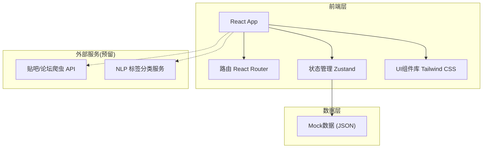

## 1. 架构设计



## 2. 技术说明
- 前端：React@18 + TypeScript + Tailwind CSS@3 + Vite
- 初始化工具：vite-init
- 后端：无（纯前端原型，使用 Mock 数据）
- 数据库：无（使用 Zustand 内存状态 + 本地 localStorage 持久化）

## 3. 路由定义
| 路由 | 用途 |
|------|------|
| / | 入口：判断是否已完成引导，未完成跳转 /onboarding，已完成跳转 /mentions |
| /onboarding | 首次使用引导页，输入门店信息 |
| /mentions | 「今日提到我」首页，时间流帖子列表 |
| /mentions/:id | 帖子详情页，原帖语境与回复观点 |
| /issues | 「问题归类」页，近七天问题聚合 |
| /replies | 「回复提醒」页，公开解释与内部整改分类 |

## 4. API定义
无后端API，使用前端Mock数据模拟。

### Mock数据结构
```typescript
interface StoreInfo {
  storeName: string
  districtName: string
  ownerAlias: string
  services: string[]
  onboardingCompleted: boolean
}

interface Post {
  id: string
  source: 'tieba' | 'cityforum' | 'xiaohongshu' | 'dianping'
  sourceIcon: string
  title: string
  content: string
  author: string
  publishedAt: string
  tags: PostTag[]
  hasImage: boolean
  imageCount: number
  replyCount: number
  replies: Reply[]
  sentiment: 'positive' | 'neutral' | 'negative'
}

type PostTag = '排队久' | '价格贵' | '态度好' | '环境差' | '味道好' | '推荐' | '差评' | '卫生问题'

interface Reply {
  id: string
  author: string
  content: string
  isAgree: boolean
  hasImage: boolean
}

interface IssueCluster {
  id: string
  category: string
  tag: PostTag
  count: number
  posts: Post[]
  suggestion: string
}

interface ReplyReminder {
  id: string
  post: Post
  type: 'public' | 'internal'
  strategy: '道歉' | '解释' | '邀请体验' | '整改' | '观察'
  draft?: string
  fixDirection?: string
}
```

## 5. 服务器架构图
不适用（纯前端项目）

## 6. 数据模型
不适用（无数据库，使用 Zustand + localStorage 持久化）

### 6.1 localStorage 键值设计
| 键名 | 类型 | 用途 |
|------|------|------|
| store_info | StoreInfo | 门店信息与引导状态 |
| posts_cache | Post[] | 帖子数据缓存 |
| reply_reminders | ReplyReminder[] | 回复提醒数据 |
